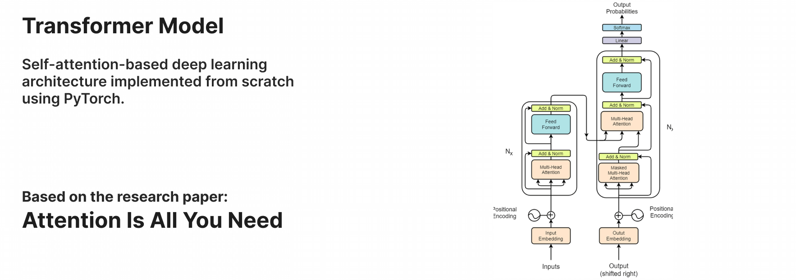

<p align="center">

</p>  

## Model Configuration
Most of the configuration aligned with the configuration proposed in the original research [paper](https://arxiv.org/pdf/1706.03762.pdf). You can play around with this value, specified in the file ```Config.ini```.
* Input-output vector dimension (```d_model```)  = 512
* Fully connected layer dimension (```d_ff```)  = 2048
* Total number of head (```head_count```) = 8
* Total number of layers (```stack```) = 6
* Dropout (```dropout```) = 0.1
* Total epoch (```epoch```) = 4
* Maximum sequence length (```max_seq```) = 90
* Batch size (```batch_size```) = 80
* Learning rate (```learning_rate```) = 0.0001

<br>

## Code Structure
  The code is structured with proper base architecture, divided into multiple packages. Here's a brief overview of each package.
  * ```src```: This is the root package for the transformer layer and custom datasets.
    * ```models```: This package consists of sub-packages for different layers of the transformer.
      * ```embedding```: Code for word embedding and positional encoding.
      * ```encoder```: Encoder layer code.
      * ```multihead_attention```: Multi-head self attention layer code.
      * ```feed_forward```: Code for fully connected layer.
      * ```decoder```: Decoder layer code.
      * ```Model.py```: Combine all the sub-packages to build a complete transformer model.
  * ```utils```: This package consists of helper classes and reusable codes.
  * ```Config.ini```: Model configurations are specified in this file.
  * ```train.py```: This module is responsible for the training of the model.
  * ```inference.py```: This module is for prediction i.e. translation in our case. 
  * ```data```: Consists of a raw data file which is used to train our model.
  * ```checkpoint```: Model state and other data are saved in this directory after each epoch.
  * ```saved```: Contains final trained state of the transformer. 

<br>

## Experiement

Here, this model is primarily developed for language translation purposes. It is trained with ```english-nepali.xlsv``` open datasets, comprising pairs of English and their corresponding translated Nepali sentences. The model is trained on a machine equipped with 16GB RAM (cuda disabled) over a duration of 9 hours. The final training loss is around 2.01. To gain a higher accuracy rate, you can train this model with high-quality large datasets over multiple epochs, leveraging high computing resources.

<br>

## Installation & Usage
#### 1.  Clone this project 
- Clone and open this project in your favorite IDE.   
- (Optional) You can create a virtual environment to run this code.
  
#### 2. Install libraries 
Install libraries that are specified in the ```requirements.txt``` file.
 ```bash  
 pip install -r requirements.txt
 ```

#### 3. Datasets and preprocessing 
If you want to train this model with your data, then follow the given steps. (Otherwise, you can skip this step)  

- Paste your data file inside ```data``` directory.
- Modify the ```__getitem___``` function within the ```CustomDataset``` class of the ```Dataset.py``` module.
- Change the ```loadData()``` function of the ```train.py``` module to load and preprocess your data.
- Specify your source and target language code (Spacy) in the ```Spacy_Language``` section of ```Config.ini```.

#### 4. Training 
Train the model by running the logic defined in the ```train.py``` module.
```bash
  py train.py
  ```
  - During training, for every epoch, we will be preserving the model state and other additional data in the ```checkpoint``` directory. This is done to ensure that we can recover and resume training in the case of a system crash or any other uncertain circumstance.  
  - After the completion of the training, we are also saving model sate, optimizer sate, and other relevant data in the ```saved``` directory, which we are going to use later for prediction in the production environment.

#### 5. Inference / Test
Before executing this step, you need to complete the training of the model because the final prediction will be done using the model state, which is saved during the training process.
``` bash
py inference.py
```

<be>
   
## License
[http://www.apache.org/licenses/LICENSE-2.0](http://www.apache.org/licenses/LICENSE-2.0)

    Copyright 2024 Puskal khadka

    Licensed under the Apache License, Version 2.0 (the "License");
    you may not use this file except in compliance with the License.
    You may obtain a copy of the License at

      http://www.apache.org/licenses/LICENSE-2.0

    Unless required by applicable law or agreed to in writing, software
    distributed under the License is distributed on an "AS IS" BASIS,
    WITHOUT WARRANTIES OR CONDITIONS OF ANY KIND, either express or implied.
    See the License for the specific language governing permissions and
    limitations under the License.
 

## Reference <h3> [Attention is all you need](https://arxiv.org/pdf/1706.03762.pdf) </h3>


